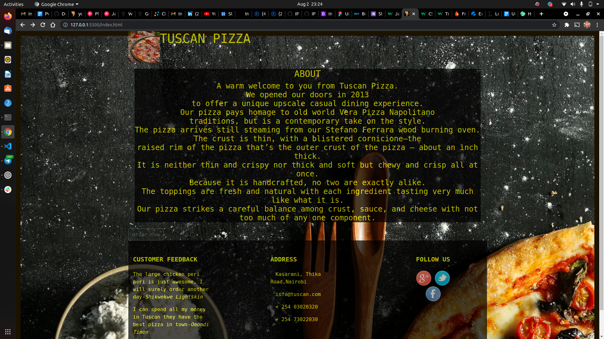
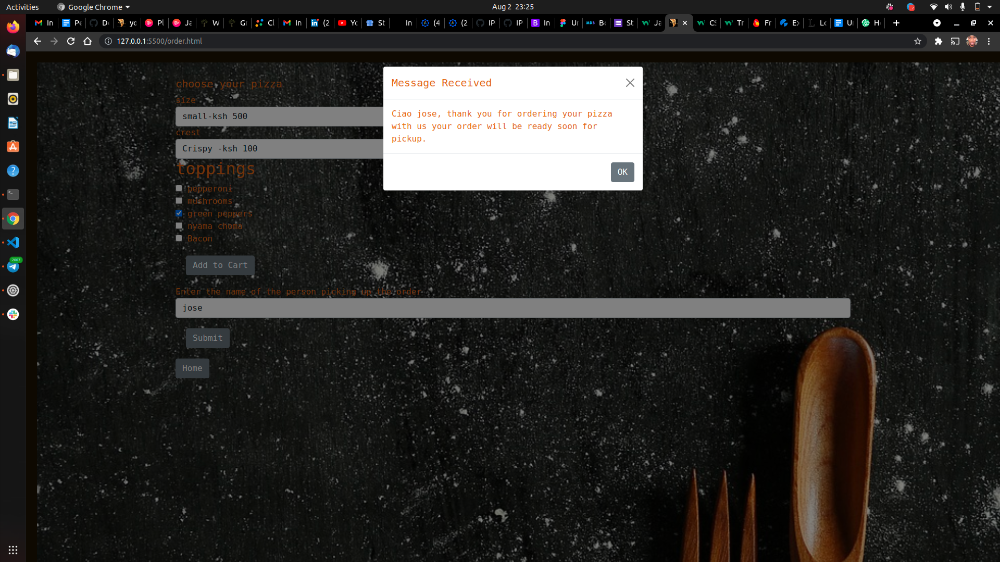
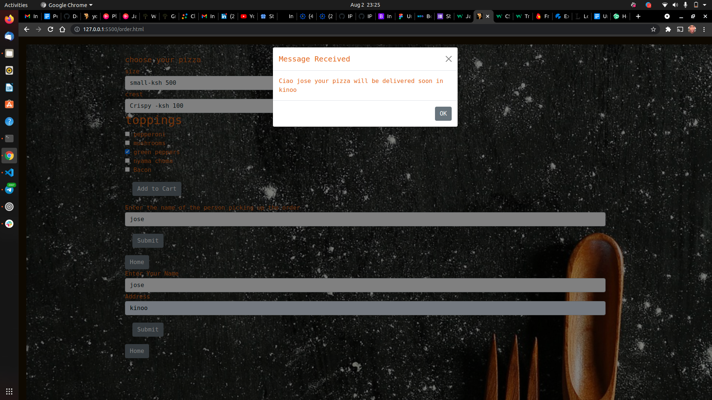

# Tuscan pizza
#### It is a e comerce website  for Tuscan pizza
#### Created By Daniel Mutua on 2-08-2021
## Description
This a two page website for Tuscan pizza shop, which we were supposed to do as our week four project.In this website you can order your favourite pizza with an option for pickup or have it delivered at your doorstep.
## Setup/Installation Requirements
* Git
* Web-browser or your choice
* Github
## Technologies Used
 The following languages have been used on this project:
 * HTML
 * CSS
 * BOOTSTRAP
 * Javascript

## Setup/Installation Requirements

* Live link to view the project <a href="https://dan-mutua.github.io/tuscan-pizza/index.html">Tuscan pizza</a>
## Some Screenshots

## Known Bugs
 So far so good there are no bugs related to this project 😎
## Support and contact details 🙂
To make a contribution to the code used or any suggestions you can click on the contact link and email us your suggestions.
* Email: daniel.mutua@student.moringaschool.com
* Phone: +254724961973
## License
* MIT licence Copyright (c) 2021 Moringa school.